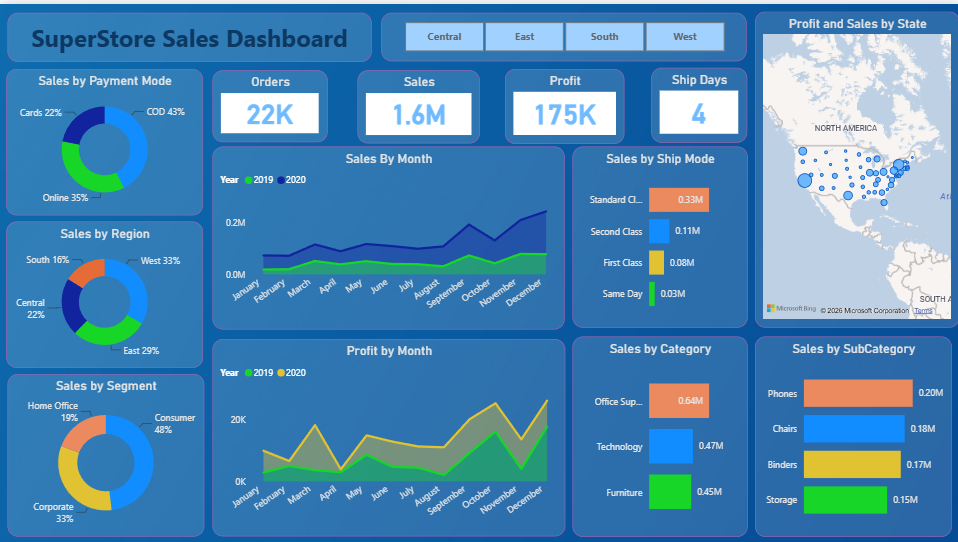

# 📊 SuperStore Sales Dashboard | Power BI

## 📌 Project Overview
This Power BI project provides a comprehensive analysis of SuperStore sales data, helping businesses monitor performance, identify trends, and make data-driven decisions. The dashboard includes sales, profit, orders, shipping analysis, regional performance, and sales forecasting.

---

## 🚀 Key Features

### Sales Dashboard
- Total Sales Analysis
- Total Profit Analysis
- Total Orders Tracking
- Average Shipping Days
- Sales by Region
- Sales by Category and Sub-Category
- Sales by Payment Mode
- Sales by Customer Segment
- Monthly Sales and Profit Trends
- State-wise Sales & Profit Visualization

### Forecast Dashboard
- 15-Day Sales Forecast
- Historical Sales Trend Analysis
- State-wise Sales Performance
- Interactive Filtering and Drill-down

---

## 🛠️ Tools & Technologies
- Power BI Desktop
- Power Query
- DAX (Data Analysis Expressions)
- Data Modeling
- Data Visualization

---

## 📈 Business Insights
- Identified top-performing states and regions.
- Analyzed category-wise and sub-category-wise sales.
- Monitored monthly sales and profit growth.
- Evaluated shipping performance and delivery efficiency.
- Generated 15-day sales forecasts to support business planning.

---

## 📷 Dashboard Preview

### Sales Dashboard


### Sales Forecast Dashboard


---

## 📂 Repository Structure

```text
power-bi-sales-dashboard/
│
├── Dashboard.pbix
├── Dataset/
│   └── SuperStore.csv
├── Screenshots/
│   ├── Sales_Dashboard.png
│   └── Forecast_Dashboard.png
└── README.md
